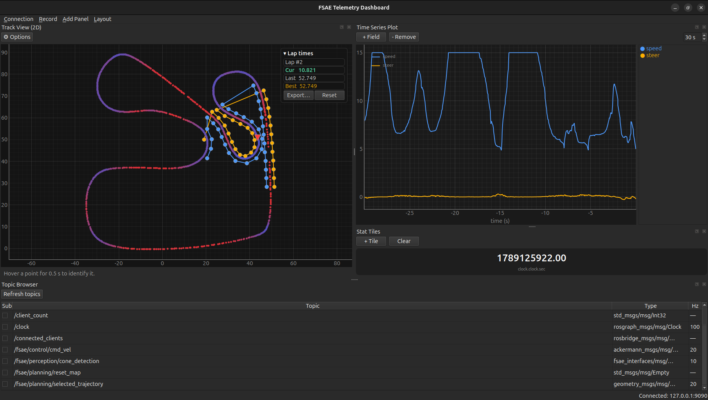

# FSAE Telemetry Dashboard

A configurable, dockable real-time visualisation app for the UOA-FSAE autonomous
ROS 2 stack. Replaces one-topic-at-a-time `ros2 topic echo` with a single
dashboard of live plots and visualisation panels. You compose your own windows
(a plot here, the track view there, CAN console at the bottom), then save the
whole layout as a YAML config file and reopen it later.



<sub>Live run against the built-in simulator — no car and no local ROS install needed.</sub>

Connects to the car over a **rosbridge / foxglove WebSocket bridge**, optionally
through an **SSH tunnel** — so it runs on Ubuntu, Windows and macOS with **no
local ROS install required**. A built-in **simulator** lets you run the entire UI
with zero infrastructure.

See [IMPLEMENTATION_PLAN.md](IMPLEMENTATION_PLAN.md) for the design rationale and
the full topic inventory it was built from.

---

## Quick start

```bash
# from this directory
python -m venv .venv
# Windows:  .venv\Scripts\activate      Linux/macOS:  source .venv/bin/activate
pip install -r requirements.txt

# run against the built-in simulator (no car needed)
python -m fsae_dashboard --mock
```

You should see a track view, a live speed/steering plot, stat tiles and a topic
browser, all updating. Use **Add Panel** to add more, drag panels around to dock
/ tab / tear them off, then **Layout → Save** to persist.

## Connecting to the car

This app speaks the **rosbridge protocol** (`rosbridge_suite`, port 9090). It
does **not** speak the Foxglove WebSocket protocol, so `foxglove_bridge` (port
8765) will *not* work — you need `rosbridge_server` running on the Jetson. See
[Jetson / remote stack setup](#jetson--remote-stack-setup) below to install it.

Once the bridge is running, in the app: **Connection → Connect…**

- **Data source `local`** (the default): use this when the dashboard runs on the
  **same machine** that publishes the ROS topics — no host or SSH to configure,
  it connects straight to `127.0.0.1`. Set the bridge port (`9090`) and, if
  rosbridge isn't already running, tick *Launch rosbridge locally on connect* to
  start it as a child process. Launch the app from a ROS-sourced shell so it can
  find `rosbridge_server` and your custom message types.
- **Data source `rosbridge`:** connect to a bridge on another machine.
  - **Bridge host/port:** the Jetson's IP and `9090`
  - **SSH tunnel** (recommended over Wi-Fi): tick it, enter the Jetson's SSH
    host/user/password-or-key. The data plane then connects to a forwarded
    `localhost` port — encrypted, and immune to DDS discovery / multicast issues.
    Tick *Launch bridge on connect* to start rosbridge remotely over SSH.

Topic names are **discovered live** (Topic Browser → *Refresh topics*) rather
than hard-coded, so a topic that has been renamed or isn't publishing is visible
immediately instead of silently breaking a panel. The stack publishes everything
under the **`/fsae`** namespace (`perception/`, `slam/`, `planning/`, `control/`,
`hardware/`, `mission/`); the default panels bind to those names.

**Disconnecting** (Connection → Disconnect) flushes all buffered data from the
previous session — your panels and window layout stay exactly as they were, but
old telemetry is cleared so the next connection starts clean.

## Recording

**Record → Record…** captures live telemetry to disk. A status-bar `● REC`
indicator shows the active recording; **Record → Stop recording** ends it (it
also stops automatically on disconnect or app exit).

- **rosbag** — pick any number of topics; drives `ros2 bag record` into a
  timestamped `rosbag_<time>/` folder, producing a real, replayable rosbag2.
  Reads the *local* ROS graph, so it fits the *local*-mode case and does not
  work over a remote rosbridge link. The dialog's **ROS setup** field is sourced
  before `ros2` (auto-filled from `$ROS_DISTRO` / `/opt/ros/*`), so you don't
  have to launch the app from a ROS-sourced shell. For **custom message types**,
  append your workspace overlay there, e.g.
  `source /opt/ros/jazzy/setup.bash && source ~/ws/install/setup.bash`. If the
  recorder can't start (e.g. `ros2: command not found`), the dialog reports why.
- **JSON** — pick one topic; writes [JSON Lines][jsonl] (one message per line)
  and works over *any* connection, since it just taps the decoded message
  stream. Files roll over at a configurable **records/file** and **MB/file** cap
  into `part_0001.jsonl`, `part_0002.jsonl`, … within a timestamped folder, so a
  single interrupted file can never take the whole recording down.

[jsonl]: https://jsonlines.org

## Replay

**Record → Replay bag…** plays a recorded rosbag back with `ros2 bag play`.
Pick the **Bags folder** where your bags live (remembered between sessions and
shared as the default record location), choose a bag from the list, set the
**playback rate** and optional **Loop**, then *Play*. A status-bar `▶` shows the
active replay; **Record → Stop replay** ends it, and it clears itself when a
non-looping bag finishes.

Replay publishes into the **local ROS graph**, so — like rosbag recording — it
needs ROS 2 on this machine. To *watch* the replay, connect in **local** mode
(to a local rosbridge): the replayed topics then show up in your panels like any
live data. The same **ROS setup** / workspace-overlay note as recording applies.

## Jetson / remote stack setup

Do this once on the Jetson (or any machine running the ROS 2 stack). Substitute
your ROS distro for `$ROS_DISTRO` — the Jetson currently runs **Humble**, the
autonomous PCs run **Jazzy**.

**1. Install the rosbridge suite** (provides `rosbridge_server` + `rosapi`, which
the app uses for live topic discovery):

```bash
sudo apt update
sudo apt install -y ros-$ROS_DISTRO-rosbridge-suite
```

**2. Make sure an SSH server is running** (only needed for the SSH-tunnel option,
which is recommended over Wi-Fi):

```bash
sudo apt install -y openssh-server
sudo systemctl enable --now ssh
```

**3. Launch the bridge** (in a sourced shell, alongside the autonomous stack):

```bash
source /opt/ros/humble/setup.bash
source ~/ros2_ws/install/setup.bash
ros2 launch rosbridge_server rosbridge_websocket_launch.xml     # listens on :9090
```

> Sourcing the workspace matters: rosbridge must know the custom
> `fsae_interfaces` message types to serialise them. Launch the bridge from a
> shell that has `install/setup.bash` sourced, or you'll get empty/failed
> subscriptions for `ConeDetection`, `Track`, `CANStamped`, etc.

**4. Verify from the laptop** before opening the app:

```bash
# reachable?
ping <jetson-ip>
# bridge port open? (use the SSH tunnel if this is blocked by Wi-Fi/firewall)
nc -vz <jetson-ip> 9090
```

**5. (Optional) Start the bridge automatically.** Either tick *Launch bridge on
connect* in the connection dialog (runs it over SSH for the session), or add it
to the stack's launch (alongside `autonomous.launch.py`) so the bridge comes up
with the car.

### Networking notes / gotchas

- **Port 9090** must be reachable, or use the SSH tunnel (which forwards it over
  port 22 and needs nothing else open). At a competition Wi-Fi network the
  tunnel is the reliable choice.
- **QoS:** some perception topics publish with `SensorDataQoS` (BEST_EFFORT).
  rosbridge subscribes RELIABLE by default and still receives BEST_EFFORT
  publishers, so this normally just works; if a specific high-rate topic shows
  no data, that's the first thing to check.
- **Type names:** the app auto-converts `pkg/Type` → `pkg/msg/Type`, so either
  form in a saved layout is fine.

### Setting it up with Claude Code on the Jetson

If the Jetson has [Claude Code](https://claude.com/claude-code) installed, you
can paste this prompt into a session **on the Jetson** to have it do the setup
and verify the bridge is serving this dashboard correctly:

> Set up a rosbridge WebSocket bridge on this machine so a remote telemetry
> dashboard (a rosbridge-protocol client, **not** Foxglove) can connect on port
> 9090.
>
> 1. Detect the ROS 2 distro (`echo $ROS_DISTRO`) and install
>    `ros-$ROS_DISTRO-rosbridge-suite` if it isn't already present.
> 2. Make sure `openssh-server` is installed and the `ssh` service is running,
>    so the dashboard can tunnel port 9090 over SSH.
> 3. Find this repo's ROS 2 workspace, build it if needed, and confirm the
>    custom `fsae_interfaces` messages are on the path. Launch rosbridge from a
>    shell that has both `/opt/ros/$ROS_DISTRO/setup.bash` and the workspace's
>    `install/setup.bash` sourced (otherwise custom types won't serialise).
> 4. Start `ros2 launch rosbridge_server rosbridge_websocket_launch.xml`, then
>    verify it's up: check the port is listening (`ss -ltn | grep 9090`), call
>    the `/rosapi/topics` service to confirm discovery works, and echo one
>    custom-type topic (e.g. a `ConeDetection` or `Track` topic) to confirm it
>    serialises without error.
> 5. Report the Jetson's IP address and the exact command to relaunch the
>    bridge. If any topic fails to serialise over rosbridge, tell me which type
>    and why.
>
> Optionally, add a `dashboard.launch.py` to the stack that brings up rosbridge
> (port 9090) with a topic whitelist parameter, so the bridge starts with the car.

## Panels

| Panel | What it shows |
|-------|---------------|
| **Time Series Plot** | Any numeric field(s) from any topic vs. time. `+ Field` to pick a topic + field. |
| **Track View (2D)** | Cones, left/right boundaries, planned trajectory, car pose + trail. The RViz replacement. |
| **Camera** | `sensor_msgs/Image` or `CompressedImage`, with fps. |
| **Stat Tiles** | Big at-a-glance values (AS state, battery voltage, …). |
| **Raw Message Inspector** | Pretty-printed latest message of any topic — the `topic echo` replacement. |
| **Topic Browser** | Live topic list with type + Hz; tick to subscribe. |
| **CAN Console** | Decoded `CANStamped` frames, filterable by ID. |

## Saving / loading layouts

**Layout → Save As…** writes a YAML file describing every panel (type + its
config) plus the exact dock geometry. **Layout → Open…** restores it. Load one at
startup with `--config path/to/layout.yaml`. The files are plain YAML — diffable
and hand-editable — so you can keep e.g. `perception_debug.yaml` and
`race_day.yaml` in version control.

## Architecture

```
transport/   data source behind one interface: mock | rosbridge (roslibpy)
data/        thread-safe ring-buffer hub + ref-counted subscription manager
ssh/         asyncssh tunnel + remote bridge launch (optional)
ui/          QMainWindow docking, dialogs, and the panels/ registry
```

- Transport callbacks (background thread) write to the **DataHub**; panels read
  snapshots on a single **30 Hz QTimer**. Message rate is decoupled from paint
  rate, which is what keeps it smooth with CAN at 100 Hz.
- Messages arrive as plain dicts (CBOR over the bridge) — no `.msg` compilation,
  so custom `fsae_interfaces` types just work on any OS.

### Adding a new panel type

Subclass `Panel`, implement `build_ui` / `get_config` / `apply_config` /
`on_tick`, decorate with `@register_panel`, and import it in
`ui/panels/__init__.py`. It appears in the **Add Panel** menu automatically.

## Dependencies

PySide6, pyqtgraph, numpy, roslibpy (data plane), asyncssh (tunnelling),
PyYAML + platformdirs (config). See `requirements.txt`.
